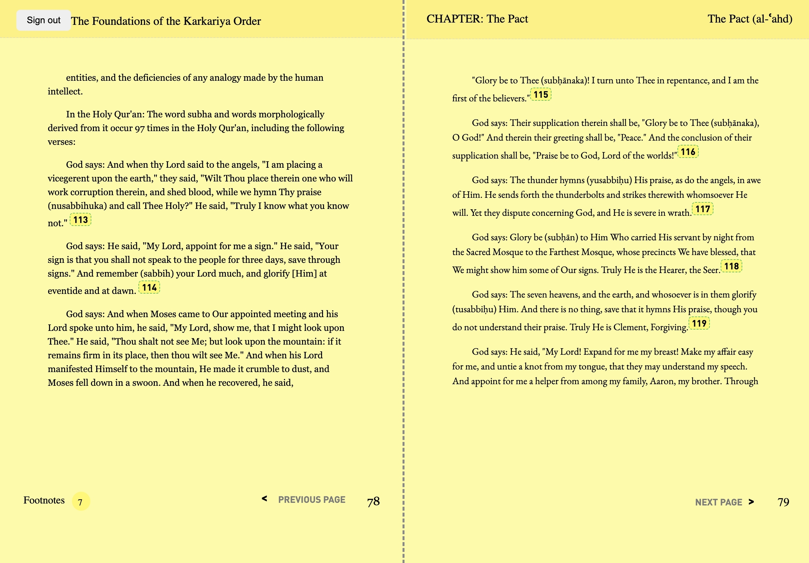

# Al-Karkari Institute E-Reader

This project is a Kindle-like e-reader experience for our client, the Al-Karkari Institute, designed to make the teachings of Shaykh Mohamed Faouzi Al-Karkari available to a global audience of academics and laymen in multiple languages.


## Purpose

The e-reader aims to:

1. Provide a beautiful reading experience on desktop, mobile, and tablet devices.
2. Offer an all-you-can-read subscription membership model.
3. Make the Shaykh's teachings accessible in multiple languages.



## Features

- User authentication
- Responsive design for various devices
- Pagination with left and right pages
- Footnote display
- Chapter and section navigation

## Technology Stack

- Remix
- Convex
- React
- TypeScript
- Tailwind CSS
- Figma
- Python (for pdf parsing, not included)

## Getting Started

1. Clone the repository
2. Install dependencies:
   ```
   npm install
   ```
3. Set up environment variables:
   Create a `.env` file in the root directory and add:

   ```
   CONVEX_URL=your_convex_url_here
   ```

4. Run the development server:
   ```
   npm run dev
   ```

## Deployment

To deploy the app:

1. Build for production:

   ```
   npm run build
   ```

2. Start the production server:
   ```
   npm start
   ```

## Project Structure

- `app/routes/reader.tsx`: Main e-reader component
- `app/components/LoginPage.tsx`: Authentication component
- `convex/`: Backend functions and database schema

## Contributing

Contributions are welcome. Please ensure you follow the existing code style and add tests for new features.

## License

[Add your license information here]
